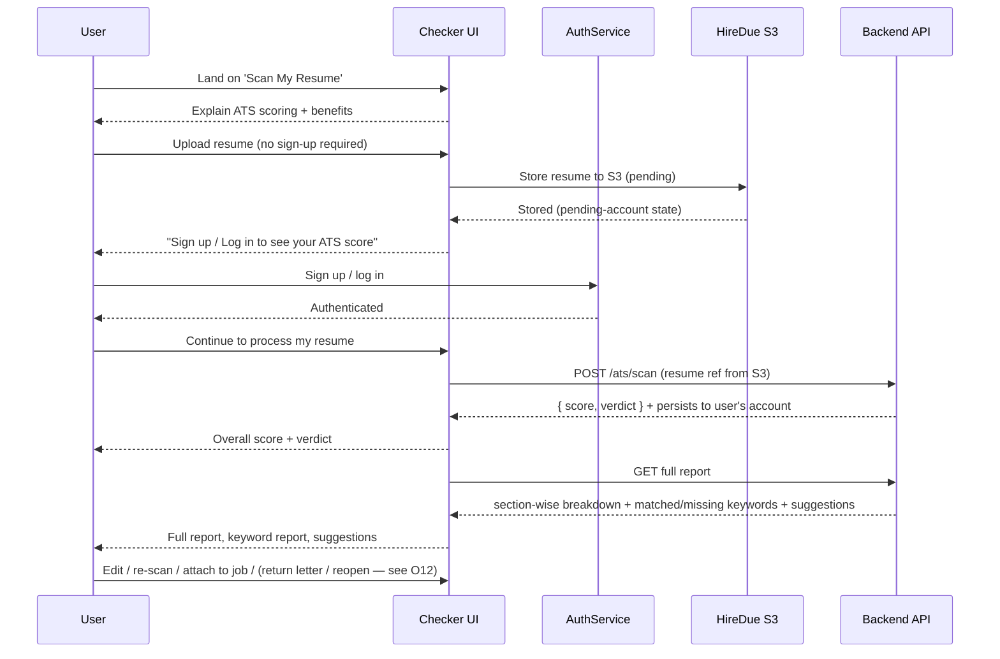

# HireDue — ATS Score Checker: Requirement Analysis

> **Status:** Draft for review  
> **Feature:** Greenfield ATS Score Checker (Resume-to-Job match score)  
> **Product context:** HireDue is a job-hunt automation platform. The ATS Score Checker is a new, standalone scoring surface that helps users measure and improve how well their resume matches a target job description.
> **Method note:** Competitor research is presented at two levels — a high-level comparison (§2.1–2.2) and a standardized **22-point** question-driven deep-dive (§2.3) covering every product evenly (problem, target user, score type, uploads, formats, account/login timing, score meaning & explanation, categories, keywords, formatting, suggestions, AI rewrites, rescan, history, and free/paid/free-limit behavior), followed by synthesized positioning guidance (§2.4–2.5). Findings are based on established, publicly documented product behavior (vendor help centers, pricing pages, and widely-cited independent reviews). Live URL fetch was blocked for several tools (e.g., Jobscan returned 403, Resume Worded 404), so the research synthesizes documented knowledge rather than a live automated crawl.

---

## Table of Contents

1. [Executive Summary](#1-executive-summary)
2. [Competitor Research](#2-competitor-research)
   - 2.1 Competitor Comparison Table
   - 2.2 Per-Product Detail
   - 2.3 Deep Research: 22-Point Standard Comparison
   - 2.4 Comparative Insights That Drive Our Requirements
   - 2.5 Cross-Competitor Synthesis: What This Means for HireDue
3. [Requirement Analysis](#3-requirement-analysis)
   - 3.1 Problem Statement
   - 3.2 Target Users
   - 3.3 User Goals
   - 3.4 Business Goal
   - 3.5 Complete User Journey (with Mermaid)
   - 3.6 Functional Requirements
   - 3.7 UX Requirements
   - 3.8 Authentication Flow
   - 3.9 ATS Score Requirements
     - 3.9.1 The Scoring Pipeline (technical reference)
     - 3.9.2 How the 0–100 Number Is Computed
   - 3.10 Error & Edge Cases
   - 3.11 Non-Functional Requirements
   - 3.12 ATS Processing Flow (with Mermaid)
4. [Confirmed / Proposed / Open Questions](#4-confirmed--proposed--open-questions)
   - 4.1 Confirmed
   - 4.2 Proposed
   - 4.3 Open Questions
   - 4.4 MVP Scope Status
   - Appendix A — Technical Notes / Existing System Context
   - Appendix B — Scoring Engine & ATS Internals Deep-Dive
     - B.1 How Scoring Engines Work (pipeline anatomy)
     - B.2 How Real ATS Systems Are Designed
     - B.3 Fact vs. Myth: What Actually Makes a Resume "ATS-Friendly"
     - B.4 How Competitor Scoring Tools Work (under the hood)
     - B.5 Implications for the HireDue Engine

---

## 1. Executive Summary

HireDue already markets **"Resume Optimization — takes your resume and tailors it for better ATS compatibility"** and shows an `matchScore: 85` visual in the products showcase, and an **"ATS"** tab in its dashboard concept. Today there is no scored, explainable ATS compatibility surface for candidates. The **ATS Score Checker** closes that gap with a **gate-on-authentication** flow: users land from search, are explained what an ATS score is and why it matters, upload a resume via the "Scan My Resume" entry point **without signing up**, and have that resume stored to **HireDue S3**. Only **after** the user signs up or logs in is the stored resume processed and scored, revealing a transparent 0–100 score with a section-wise breakdown, matched-vs-missing keyword report, and concrete suggestions. **No ATS score, preview score, verdict, or analysis of any kind is shown before authentication.** A set of post-score tools (edit/improve, re-scan, resume history, attach-to-job, return letter, audit trail) is planned, some confirmed and others still **Proposed** (see §4). The resume and scan data are **stored to the user's account** after authentication so every subsequent action is persistent and personal.

This document defines the product and engineering requirements for that feature, grounded in research across 8 competing ATS-checker products, and clearly separated into **Confirmed** (already decided/derivable from the codebase and strategy), **Proposed** (recommended but not yet decided), and **Open Questions** (needs product/business input).

---

## 2. Competitor Research

This section presents competitor research at two levels. **§2.1–2.2** give a high-level comparison of the dimensions that matter most on landing and product pages. **§2.3** is a standardized **22-point deep-dive** that answers the same explicit research questions for all 8 products (what problem, who for, resume-only vs +JD, uploads, file formats, account need, login timing, score visibility pre-login, score meaning/explanation, categories, keyword extraction, missing keywords, formatting detection, suggestions, AI rewrites, rescan, history, free tier, paid tier, free-limit behavior). **§2.4–2.5** synthesize the takeaways into positioning guidance for HireDue.

### 2.1 Competitor Comparison Table

| Dimension | Resume Worded | Jobscan | Resume.io | Zety | Rezi | Kickresume | Teal | Enhancv |
|---|---|---|---|---|---|---|---|---|
| **Landing UX** | Instant "Drop your resume" hero, animated scrolling sample report | Pulsing "Scan My Resume" hero; narrative around ATS pass rates | Template-first editor with score badge woven into editor | Form-driven builder; free "score/preview" gimmick | Score preview behind account gating; AI-first | Editor with live score progress ring | Job-tracker first; score tied to a specific saved job | Score/animated visual as part of builder marketing |
| **Upload flow** | Drag-and-drop resume → instant scan (no JD required for basic) | Paste JD + paste/upload resume, two-pane | Upload or select a professional template | Paste/type resume content in editor | Paste resume + target job | Upload resume or build new in editor | Upload resume + attach/paste JD to a job record | Build in-editor; upload optional |
| **Login timing** | Results visible before login; login gated on "unlock full report" | Full report requires account; partial preview free | Free with account; deep suggestions paid | "Score" teaser pops before heavy login | Account required to run scan | Account required to save/edit | Account required (tool is job-hunting app) | Account required to save |
| **JD required?** | No (general scan). Optional "match vs dream job" | **Yes** (match is core) | No (generic compatibility) | No | Yes for match score | Optional | **Yes** (tied to saved job) | No (generic) |
| **Score breakdown** | "Resume Score" (0–100) + graded sub-categories (impact, keyword, sections, education, length) | Front-end match rate vs JD + key skills coverage, missing skills, red flags | ATS score + readability score (per-resume) | ATS score % + per-section critique | Match % per job + keyword coverage per section | Score per section (skills, summary, experience) | Owned "Match Score" per JD with strengths/gaps | ATS score + recruiter-read score |
| **Keyword analysis** | Shows matched keywords, missing in-demand keywords, per section | Two-pane diff: keywords in JD vs resume, density warnings | Keyword presence, missing skills | Missing/suspect keywords list | Extracted JD keywords vs resume coverage | Skill/tool presence gaps | JD keyword extraction, matched/missing, "Target Keywords" panel | Autodetect industry keywords, suggestions |
| **Suggestions** | One-click bullet rewrite, impact-verb suggestions, section tips | Rewrite bullets, add keywords, quantify, education formatting fixes | Inline editor guidance + AI rewriter (paid) | Step-by-step content tips per section | AI generated bullet points, paragraph rewrites | Bullet rewrites, tips | "Add these skills" + bullet rewrite | Rewrite bullet with tone control |
| **Strengths** | Free instant value, transparent categories, fast | Gold-standard JD matching, granular match rate, benchmarks vs your own applications | Beautiful UX, integrates builder + score seamlessly | High-volume SEO, low barrier, generous free tier content | Speed and AI-generation focusing on match | Playful UX, easy template + score loop | Job-hunting app synergy, store score per job | Strong editing + "impact" framing |
| **Weaknesses** | JD-scoring weaker; lots of upsell friction; no per-job persistence | Paywalled after scans; account-gated; opaque weightings | Deep analysis and APIs gated behind paid plan | Score can feel cosmetic; JD-matching minimal | Score can oversimplify; heavy account gating | Less rigorous; score secondary to template focus | Setup overhead; score tied to tracker you may not want | JD matching weaker; account/save required |
### 2.2 Per-Product Detail

#### 2.2.1 Resume Worded
- **Landing page UX:** A "Get your free resume score" hero with a single drop zone; the promise is instant. Sample animated report scrolls to build trust before any signup.
- **Resume upload flow:** Drag-and-drop a PDF/resume image → immediate scan; also lets you paste resume text. No JD needed for the base score.
- **Login timing:** Full free report is shown first; login is gated only around unlocking deeper per-line suggestions ("sign in to see more").
- **JD requirement:** Not required for the base scan. An optional "match resume to a dream job" path exists.
- **Score breakdown:** 0–100 "Resume Score" with graded sub-categories (length, impact, sections, keyword, education) — each with letter-style quality indicators.
- **Keyword analysis:** Matched and missing in-demand keywords surfaced per section, tied to the target role.
- **Suggestions:** One-click bullet rewrites, stronger impact verbs, quantifying guidance, section-specific tips.
- **Strengths:** Instant free value, transparent scoring dimensions, fast scan time.
- **Weaknesses:** JD-matching is weaker than its generic scan; heavy paid upsell on individual suggestions; no per-job persistence.

#### 2.2.2 Jobscan
- **Landing page UX:** Pulsing "Scan My Resume" hero; strong narrative on ATS pass rates. Output is a "match rate" against a specific job.
- **Resume upload flow:** Classic two-pane model — paste the job description on the left, paste/upload resume on the right — then scan.
- **Login timing:** A preview of the match rate is shown free; the full breakdown (keywords, missing skills, rewrite tools) requires creating an account. Limited number of free scans per period.
- **JD requirement:** **Required** — the match is the core product.
- **Score breakdown:** Match rate / "ATS compatibility" %, hard-skill coverage, missing skills, keyword density warnings, and red flags.
- **Keyword analysis:** Highlights keywords present in the JD, shows which appear in the resume, flags over-/under-density, lists missing "key skills."
- **Suggestions:** Bullet rewrites, adding missing keywords, quantifying achievements, education-section formatting fixes.
- **Strengths:** The industry's most recognized JD-matching model; granular, explainable match rate; benchmarks against your own application history.
- **Weaknesses:** High paywall (Open/Optimize scans consumed per plan), account-required, weighting model not fully transparent.
---
#### 2.2.3 Resume.io
- **Landing page UX:** Template-first. Score is woven **inside the editor** (a floating ATS/readability score that updates live as you type).
- **Resume upload flow:** Start from a template or import an existing resume; score is computed for the document you are editing.
- **Login timing:** Editing and basic score available with account; advanced AI suggestions and some analytics gated behind the paid plan.
- **JD requirement:** Not required — scoring is general ATS compatibility plus readability.
- **Score breakdown:** ATS score and readability score (two distinct meters), each per-document.
- **Keyword analysis:** Presence of keywords and missing skills, generally derived from your target role rather than a pasted JD.
- **Suggestions:** Inline editor guidance, then AI rewriter on the paid tier.
- **Strengths:** Beautiful UX; score and content editing feel like one product; strong readability dimension.
- **Weaknesses:** JD match is not the focus; deep analysis is paid.

#### 2.2.4 Zety
- **Landing page UX:** High-volume SEO, form-driven builder. "ATS score" appears as a free preview to draw people into the builder.
- **Resume upload flow:** You compose resume content in the editor rather than uploading a parsed file; paste/type content.
- **Login timing:** The score teaser pops early; full editing/saving is account-required. Generous free tier for exploration.
- **JD requirement:** Not required for the generic ATS score; JD-specific matching is minimal.
- **Score breakdown:** ATS score % plus per-section critique.
- **Keyword analysis:** Missing or "suspect" keyword lists.
- **Suggestions:** Step-by-step content tips per section of the builder.
- **Strengths:** Low barrier, strong free-tier content, massive organic reach.
- **Weaknesses:** Score can feel cosmetic; JD matching is weak compared to Jobscan/Rezi.

#### 2.2.5 Rezi
- **Landing page UX:** AI-first; score preview gated behind account creation. Focus on the ideal resume for "real-world AI HR."
- **Resume upload flow:** Paste resume + input target job → generates match score and keywords.
- **Login timing:** Account required to run a scan.
- **JD requirement:** Yes for the match score (target job/description input).
- **Score breakdown:** Match % per job; keyword coverage per resume section.
- **Keyword analysis:** Extracts JD keywords and measures coverage across sections.
- **Suggestions:** AI-generated bullet points, section paragraph rewrites targeting the JD.
- **Strengths:** Fast, AI-driven rewrite directly wired to the JD.
- **Weaknesses:** Score is simplified; account-gating adds friction before value.

#### 2.2.6 Kickresume
- **Landing page UX:** Playful, template-forward editor with a live score progress ring.
- **Resume upload flow:** Upload a resume or build in editor; score computed on the document.
- **Login timing:** Account required to save or edit; score shown in editor.
- **JD requirement:** Optional.
- **Score breakdown:** Score per section (skills, summary, experience), each with tips.
- **Keyword analysis:** Skill/tool presence gaps.
- **Suggestions:** Bullet rewrites and tips.
- **Strengths:** Accessible UX; good template-to-score loop.
- **Weaknesses:** Less rigorous matching; score is secondary to the builder.

#### 2.2.7 Teal
- **Landing page UX:** Job-hunting **app** first (tracker/cover letters). The "Match Score" is tied to a specific saved job.
- **Resume upload flow:** Upload resume and paste/attach a JD into a job record; score is computed against that job.
- **Login timing:** Account required — it is a full job-hunting product, not a one-off scanner.
- **JD requirement:** **Yes** — score is per-saved-job.
- **Score breakdown:** Teal's Match Score per JD, with strengths/weaknesses and keyword gaps.
- **Keyword analysis:** JD keyword extraction, matched vs missing, "Target Keywords" panel.
- **Suggestions:** "Add these skills" + bullet rewrite against the target JD.
- **Strengths:** Score is persistent and contextual per job; synergy with a job tracker.
- **Weaknesses:** Heavier setup; the score exists only inside the tracker context.

#### 2.2.8 Enhancv
- **Landing page UX:** Marketing-led; emphasizes ATS score and recruiter-read score and "impact" framing, with animated visuals.
- **Resume upload flow:** Build in the editor; upload optional.
- **Login timing:** Account required to save.
- **JD requirement:** No for generic; JD matching weaker.
- **Score breakdown:** ATS score + recruit-read score (two meters) and impact language detection.
- **Keyword analysis:** Industry keyword autodetection and suggestions.
- **Suggestions:** Bullet rewrite with tone/impact control.
- **Strengths:** Strong editing experience and compelling "impact" narrative.
- **Weaknesses:** JD-specific matching less central; account/save required.
### 2.3 Deep Research: 22-Point Standard Comparison

This is a standardized, question-driven investigation applied equally to all 8 competitors. Each row answers one question from the research brief; a **→ HireDue** note captures the takeaway that informs our requirements. Symbols: ✅ yes, ⚠️ partial/conditional, ❌ no.

#### 2.3.0 Question Key
| # | Question |
|---|---|
| 1 | What problem are they solving? |
| 2 | Who is their target user? |
| 3 | Score is resume-only or resume + job description? |
| 4 | What does the user upload? |
| 5 | What file formats are supported? |
| 6 | Does the user need an account? |
| 7 | When does login happen? |
| 8 | Is the score visible before login? |
| 9 | What does the score mean? |
| 10 | How is the score explained? |
| 11 | What categories are evaluated? |
| 12 | Are keywords extracted? |
| 13 | Are missing keywords shown? |
| 14 | Are formatting problems detected? |
| 15 | Are suggestions provided? |
| 16 | Are AI rewrites provided? |
| 17 | Can users rescan? |
| 18 | Can users save previous scans? |
| 19 | What is free? |
| 20 | What is paid? |
| 21 | What happens when the free limit is reached? |
| 22 | Strengths / Weaknesses (for HireDue positioning) |

#### 2.3.1 Full Matrix (Part A — Resume Worded, Jobscan)

| # | Resume Worded | Jobscan |
|---|---|---|
| 1 Problem | Candidate doesn't know why their resume isn't getting interviews | Candidate scores low match against a **specific job** and can't get past the ATS |
| 2 Target user | Job-seekers fast-scoring a resume; quality-of-writing focus | Active applicants tailoring to one open role/JD |
| 3 Resume-only or +JD | Resume-only base; **optional** match to dream job/JD | **Resume + JD (required)** — match is core |
| 4 User uploads | Resume file (PDF/image) or pasted text | Resume text/file + **pasted JD** |
| 5 File formats | PDF, DOCX, image (PNG/JPG), plain text; paste | PDF, DOCX; text paste |
| 6 Account needed? | ❌ base score; ✅ to unlock full report | ⚠️ base match preview free; ✅ full report |
| 7 When login | After seeing score, to unlock line-level suggestions | After preview scan, to unlock breakdown + tools |
| 8 Score before login? | ✅ yes (headline score) | ⚠️ preview only (partial) |
| 9 Score meaning | 0–100 "Resume Score" = overall resume strength/readability | 0–100 "Match Rate" = how well resume fits that JD |
| 10 Score explained | Graded sub-categories w/ quality letters + per-line reasons | Weighted categories + two-pane matched/missing text |
| 11 Categories | Length, impact, keyword, sections, education | Keyword coverage, hard skills, missing skills, format/red flags |
| 12 Keywords extracted | ✅ in-demand keywords (role-based) | ✅ from the JD (two-pane diff) |
| 13 Missing keywords shown? | ✅ per-section | ✅ **core feature** |
| 14 Formatting problems detected? | ✅ (sections, headers, length) | ✅ (parse/format red flags) |
| 15 Suggestions | ✅ per section | ✅ targeted bullet + keyword suggestions |
| 16 AI rewrites | ✅ (bullet rewrites) | ✅ (Optimize / rewrite) |
| 17 Rescan | ✅ (re-scan same resume) | ✅ (re-scan after editing) |
| 18 Save previous scans | ❌ (no persistent history) | ⚠️ history tied to account/applied jobs |
| 19 Free | Base score + preview report | Limited free scans + preview match rate |
| 20 Paid | Full report, suggestions, exports | Full report, unlimited scans, optimize (subscription/tokens) |
| 21 Free-limit behavior | Soft paywall; pay per report unlock | Runs out of Open/Optimize credits → upgrade prompt |
| 22 Strengths/Weaknesses | Fast instant value, transparent categories / weak JD match, heavy upsell, no history | Gold-standard JD matching, granular / paywalled, account-gated, opaque weights |
| → HireDue | Don't copy the headline-score-pre-login teaser (Resume Worded). Instead **gate-on-auth**: store the uploaded resume to S3 first, explain the value, and show **no score** until sign-up; add the persistence they lack | Adopt two-pane JD match + missing-keyword surfacing; gate deep tools by plan |

#### 2.3.2 Full Matrix (Part B — Resume.io, Zety)

| # | Resume.io | Zety |
|---|---|---|
| 1 Problem | Users want a good-looking, ATS-safe resume with editing + validation in one place | Users overpay for resume builders; free ATS preview drives builder signup |
| 2 Target user | Resume-builder customers who want a safe template | High-intent, SEO-driven resume seekers; often first-time resume makers |
| 3 Resume-only or +JD | **Resume-only** (generic ATS compatibility) | **Resume-only** (generic ATS %) |
| 4 User uploads | Resume file or starts from a template | Composes resume content in the editor (paste/type) |
| 5 File formats | PDF, DOCX | PDF, DOCX, text in editor |
| 6 Account needed? | ⚠️ free with account; deeper analysis paid | ⚠️ teaser free; full editor/save needs account |
| 7 When login | To save/edit and unlock analytics | After score teaser, to edit/save |
| 8 Score before login? | ⚠️ with account; headline may show in-editor | ⚠️ score teaser visible pre-account |
| 9 Score meaning | ATS score + readability score (per-document fit) | "ATS score %" = general likelihood a parser reads resume cleanly |
| 10 Score explained | Two independent meters (ATS + readability) with tips | Per-section critique + overall % |
| 11 Categories | Structure/sections, readability, keyword presence | Sections, content, "suspect" keywords, formatting |
| 12 Keywords extracted | ⚠️ role-based presence, not strong JD extraction | ⚠️ limited; missing-keyword lists |
| 13 Missing keywords shown? | ⚠️ some | ⚠️ "suspect"/missing lists |
| 14 Formatting problems detected? | ✅ (readability/format warnings) | ✅ part of critique |
| 15 Suggestions | ✅ inline editor guidance | ✅ step-by-step per section |
| 16 AI rewrites | ✅ paid tier | ⚠️ assisted writing (paid) |
| 17 Rescan | ✅ (live as you type) | ✅ (re-run analysis) |
| 18 Save previous scans | ⚠️ save documents, not score history | ⚠️ save documents |
| 19 Free | Account + basic editor + basic score | Generous free tier content, teaser score |
| 20 Paid | Advanced AI, analytics, exports | Full editing, exports, premium templates |
| 21 Free-limit behavior | Feature lock (AI/analytics) behind paid | Popup/CTA to upgrade for full features |
| 22 Strengths/Weaknesses | Beautiful builder+score integration, readability / JD match not core; analysis paid | SEO reach, low barrier / cosmetic score, weak JD matching |
| → HireDue | Expose a second readability/format meter; keep it secondary to keyword match | Score can feel gimmicky — make ours transparent/weighted to stay credible |

#### 2.3.3 Full Matrix (Part C — Rezi, Kickresume)

| # | Rezi | Kickresume |
|---|---|---|
| 1 Problem | Candidates want AI that rewrites their resume to match a target job | Users want a fun builder that validates a resume as it's made |
| 2 Target user | Tech/competitive applicants who want JD-matched, AI-generated resumes | Career switchers, students, builder-first users |
| 3 Resume-only or +JD | **Resume + JD** (target job input for match) | Resume-only (generic), JD optional |
| 4 User uploads | Pasted resume + target job/title | Resume file upload or in-editor build |
| 5 File formats | PDF, DOCX, text paste | PDF, DOCX, text |
| 6 Account needed? | ✅ to run a scan | ✅ to save/edit |
| 7 When login | Before scanning | Before saving/editing; score in editor |
| 8 Score before login? | ❌ (account-gated) | ⚠️ in-editor after account |
| 9 Score meaning | "Match %" per target job | Per-section score (skills, summary, experience) |
| 10 Score explained | Keyword coverage per section | Progress ring + per-section tips |
| 11 Categories | Keyword match, section coverage | Skills, summary, experience, formatting |
| 12 Keywords extracted | ✅ from JD | ⚠️ skill/tool gaps |
| 13 Missing keywords shown? | ✅ | ⚠️ partial |
| 14 Formatting problems detected? | ⚠️ | ✅ (template-based) |
| 15 Suggestions | ✅ AI-generated | ✅ tips + rewrites |
| 16 AI rewrites | ✅ core | ⚠️ some |
| 17 Rescan | ✅ | ✅ |
| 18 Save previous scans | ⚠️ | ✅ (save resume versions) |
| 19 Free | Free trial / limited AI scan | Free builder basics; score included |
| 20 Paid | Unlimited AI, exports, templates | Premium templates, AI, exports |
| 21 Free-limit behavior | Trial ends → subscription prompt | CTA to upgrade for premium |
| 22 Strengths/Weaknesses | Fast JD-matched AI rewrite / oversimplified, account-gated | Playful, low-friction / less rigorous matching |
| → HireDue | Wire suggestions directly to the JD (Rezi strength) but, per gate-on-auth, give users a no-account S3 upload + a clear explanation before requiring sign-up — no score until auth | Keep structure/scoring simple to understand; don't let tools feel secondary |

#### 2.3.4 Full Matrix (Part D — Teal, Enhancv)

| # | Teal | Enhancv |
|---|---|---|
| 1 Problem | Help candidates manage the whole job hunt and see per-job fit | Make resumes "impactful" for both ATS and human recruiters |
| 2 Target user | Serious, organized job-seekers using a tracker + resume tools | Career-focussed candidates seeking visually strong, ATS-safe resumes |
| 3 Resume-only or +JD | **Resume + JD** (score tied to saved job) | Resume-only (JD matching weaker) |
| 4 User uploads | Resume file + JD pasted per saved job | Build in editor; upload optional |
| 5 File formats | PDF, DOCX | PDF, DOCX |
| 6 Account needed? | ✅ (full app) | ✅ to save |
| 7 When login | At signup (account-first) | Before saving |
| 8 Score before login? | ⚠️ only inside logged-in app | ⚠️ marketing preview |
| 9 Score meaning | "Match Score" per specific JD | ATS score + recruiter-read score |
| 10 Score explained | Strengths/gaps + "Target Keywords" panel | Two meters + impact-language detection |
| 11 Categories | Hard skills, keyword, experience alignment | Keywords, impact verbs, formatting, readability |
| 12 Keywords extracted | ✅ from JD | ✅ industry autodetect |
| 13 Missing keywords shown? | ✅ core | ✅ suggestions |
| 14 Formatting problems detected? | ⚠️ | ✅ |
| 15 Suggestions | ✅ "add these skills" + bullet rewrite | ✅ tone/impact rewriting |
| 16 AI rewrites | ✅ | ✅ |
| 17 Rescan | ✅ per job | ✅ |
| 18 Save previous scans | ✅ persistent per job (strongest) | ⚠️ save document versions |
| 19 Free | Free tier with job tracking + matching | Free editor; some analysis paid |
| 20 Paid | Premium matching/apply tools | Premium AI, templates, exports |
| 21 Free-limit behavior | Feature gating for premium job tools | CTA/upsell for full AI |
| 22 Strengths/Weaknesses | Persistent, contextual score + tracker synergy / setup overhead, app-only | Impact framing, strong editing / JD match not central, account/save required |
| → HireDue | Adopt **persistence** + attaching a score to a job (Teal's retention lever) | Use dual meters (ATS + recruiter/"impact") as a secondary signal, not the headline |

### 2.4 Comparative Insights That Drive Our Requirements

1. **Two distinct scoring philosophies exist:** *generic ATS compatibility* (Resume Worded base, Resume.io, Zety) vs. *JD-specific match rate* (Jobscan, Teal, Rezi). HireDue should support **both** — a lightweight generic score (no JD input needed) and a deeper JD-match when a job description is supplied. Both run post-authentication per the gate-on-auth funnel.
2. **The clearest winner for explainability is the two-pane JD match** (Jobscan/Teal): extract JD keywords, show matched/missing, and rewrite bullets. This is what users trust and pay for.
3. **Gate the full score behind authentication, but make the *why* clear before sign-up.** Account-first tools (Teal/Rezi) maximize per-user data and capture resumes to an account before any score is shown, while Resume Worded shows a headline score pre-login to reduce friction. HireDue's **gate-on-authentication** sits with Teal/Rezi: the visitor is *explained* the value of an ATS score on the page and asked to upload a resume — which is stored to **HireDue S3** — but **no score, preview, verdict, or analysis is shown until the user signs up or logs in**. Sign-up is the gate before the resume is even processed.
4. **Every serious product drives toward editable, concrete suggestions** per section — not just a number.
5. **Persistence matters for paid value:** Teal's per-job score persistence is the strongest retention mechanism. Persistence should be gated to authenticated/subscribed users.
6. **Format/readability is a second dimension worth exposing** (Resume.io, Enhancv), but it should be secondary to keyword matching.
7. Most competitors **gate unlimited scans** behind a subscription — an obvious monetization lever for HireDue's existing plan system.

### 2.5 Cross-Competitor Synthesis: What This Means for HireDue

Distilling all 8 products across the 22 questions, the decisions our feature should mirror (or deliberately reject):

| Decision area | Leader to emulate | Anti-pattern to avoid | HireDue position |
|---|---|---|---|
| Score type | JD-aware Match (Jobscan, Teal) + generic health (Resume Worded) | Single superficial % (Zety) | Support **both** modes; headline = generic health, deep = JD match |
| Score visibility pre-login | Resume Worded (rough headline only) | Full-featured report to anonymous users | **Gate-on-auth**: **no score/verdict/analysis before sign-up**; resume stored to S3 first, scored only after auth |
| Keywords/missing skills | Jobscan/Teal two-pane matched vs missing | Tease keywords but hide them | **Always show** matched + missing in JD mode |
| Format/readability | Resume.io/Enhancv second meter | Ignore format entirely | Expose a secondary format/readability signal |
| Suggestions | Jobscan/Rezi/Teal concrete + rewrite | Bare counts / no action | Prioritized suggestions **with rationale** + bullet rewrites (paid) |
| Rescan loop | Resume Worded live feedback | No delta shown | Re-scan with **delta (+N)** |
| Persistence | Teal per-job history | Resume Worded no history | **Account-keyed storage** of resume + versioned scan history (auto at upload for signed-in users) |
| Free tier | Resume Worded generous | Rezi heavy gate | Free upload + S3 storage; **score gated behind auth**, upgrade on quota |
| Login timing | Deferred, optional (Resume Worded) | Account-first before any scan (Teal/Rezi) | **Gate-on-auth**: upload + S3 storage, then sign-up before the resume is processed or scored |
| Monetization | Scan quotas (Jobscan) | Unlimited free forever | **Quota-gated** unlimited scans on paid plans |

---

## 3. Requirement Analysis

### 3.1 Problem Statement

Hiring managers and ATS software filter resumes before a human ever reads them. Candidates apply to roles "blind," unable to tell whether their resume matches the job description until it is silently rejected. HireDue already optimizes resumes, but there is **no scored, explainable surface** — tied to the candidate's own account — that a user can use to: (a) see how compatible their resume is with a role, (b) understand *why* the score is what it is at the **section level** (e.g., Technical 8/10), and (c) act on concrete improvements (matched vs missing keywords, "use X instead of Y," bullet rewrites) before applying. The result is wasted applications, low response rates, and distrust in "the black box."

Job hunting is a learning loop: the faster a candidate can measure fit and improve, the more applications convert. **Without an ATS Score Checker, HireDue surfaces the "what" (auto-applied roles) but not the "why" (match quality) that drives candidate confidence and iterative improvement.** Because the resume and its scan history are **stored to the user's account**, every re-scan, job attachment, and follow-up letter builds on the same corpus — turning a one-shot score into a persistent, reviewable improvement workflow.

### 3.2 Target Users

**Primary persona — "The Active Applicant":**
- Job-seekers actively applying (early/mid/senior professional, and career-switchers).
- Applying across multiple platforms, tailoring resumes per role.
- Frustrated by low response rates and opaque rejection.
- Motivated to improve the *quality* of each application that HireDue automates.

**Secondary personas:**
- **Freelancers / gig workers** wanting quick compatibility checks against contract postings.
- **Students / new grads** with thin or template-heavy resumes needing structural feedback.
- **Career changers** needing keyword/bridge-skills guidance to pivot into new fields.

**Non-goal / out of scope for v1:**
- Employers/recruiter-side candidate ranking.
- Multi-language resume scoring (v1 is English-only, see Open Questions O5).

### 3.3 User Goals

1. Get a fast, trustworthy 0–100 ATS compatibility number for my resume.
2. Understand *why* the score is what it is (per-section breakdown, not a black box).
3. See exactly which keywords/job-description terms my resume is missing — and what to replace them with.
4. Receive concrete, editable suggestions to raise the score (rewrite bullets, add skills, fix structure).
5. Compare my resume against a specific job description and see what "good" looks like for that role.
6. Re-scan after editing to see the score improve (the "feedback loop").
7. Save my resume and scans to my account so I can track multiple roles, attach them to jobs, and reopen them later.
8. Generate supporting documents (e.g., a return/cover letter) from my scored, optimized resume.
### 3.4 Business Goal

- **Activation & conversion:** Land anonymous search traffic with an easy, no-account upload that stores the resume to **HireDue S3** immediately, then convert them to sign up with the promise of a full, transparent 0–100 score — the section-wise breakdown, keyword detail, edits, persistence, and job tools. Sign-up is the gate _before_ any score is shown and before the resume is even processed, so every real scan and score is tied to an account.
- **Retention & monetization:** Drive repeat engagement through the re-scan feedback loop, persistent per-account resume history, attach-to-job, and the return-letter tool; gate unlimited scans and AI rewrite behind HireDue's existing paid tiers.
- **Product coherence & differentiation:** Make the marketed "ATS optimization" promise tangible before purchase; deepen the "Recruiter Hits / match quality" pillar already in the landing copy. A transparent, JD-aware score differentiates HireDue from generic template editors.
- **Revenue KPI:** Lift the free→paid trial conversion via the upgrade-gated scan quota (exact target to be confirmed — see O9).

### 3.5 Complete User Journey

The journey below is the reference flow for v1. The flow uses the **gate-on-authentication funnel**: an anonymous user can open the ATS Score Checker, have ATS scoring explained, upload a resume (which is stored to **HireDue S3**) **without signing up**, and is then asked to sign up or log in. **No ATS score, preview score, verdict, or analysis of any kind is shown before authentication.** **Only after** the user signs up or logs in is the stored resume processed and the full result revealed.

> **Gate-on-authentication funnel (definition):** the funnel lets an anonymous user upload a resume (stored to **HireDue S3**), then requires sign-up/login **before the resume is processed or scored**. No score, preview, verdict, or analysis is surfaced to the user before authentication. Once signed in, the stored resume is processed and the full report (0–100 score, section breakdown, keywords) is shown and persisted to the user's account.

```mermaid
flowchart LR
    A[Open the ATS Score Checker] --> B[Explain ATS scoring\n+ its benefits]
    B --> C[Upload Resume\n(no sign-up required)]
    C --> D[Resume saved to HireDue S3]
    D --> E[Sign Up / Log In\nrequired to see your score]
    E --> F[Process resume - only\n after successful auth]
    F --> G[Show ATS Score + full analysis]
    G --> H[Improve and Re-scan]
```

> **Note:** There is **no preview path**. Users must not see any ATS score, preview score, verdict, or analysis before signing up or logging in. The upload step simply stores the resume to **HireDue S3**; scoring (processing) happens **only after** successful authentication. The full report — score, section breakdown, keyword detail, edits, persistence, and attach-to-job — all require a signed-in, authenticated account. Return letter and audit trail, where included, are gated behind the account as well (see O12 for which ones ship). This maximizes per-user data capture and personalization per the product goal above.

**Journey notes:**
- **Step "Explain ATS scoring"** is a content/education moment on the ATS Score Checker page explaining what an ATS score is and why improving match quality matters — shown to all anonymous visitors before they upload.
- **Step "Upload"** stores the resume to **HireDue S3** immediately, but does **not** run any scoring. The resume is in a **pending-account** state until the user authenticates. See Open Questions O4 for how long a pending upload may be retained.
- **Step "Sign Up / Log In"** is the hard gate. Users who complete auth return to the flow; once authenticated, the stored resume is fetched from S3 and processed.
- **Step "Process resume"** runs only after successful authentication (with or without a JD). Without a JD → generic ATS compatibility score + section-wise health. With a JD → full match score, matched/missing keywords, and "use X instead of Y" replacement guidance.
- **Authenticated scans** store the resume and report to the account after processing; an upgrade nudge appears when the free-scan quota is used up.
### 3.6 Functional Requirements

#### 3.6.1 Resume Input & Parsing
- **FR-1 [Confirmed]** Support resume upload via drag-and-drop and file picker.
- **FR-2 [Confirmed]** Accept at least: PDF, `.docx`, `.txt`, and pasted plain text.
- **FR-3 [Proposed]** Accept `.doc`, `.rtf`; recommend conversion for best results.
- **FR-4 [Confirmed]** Enforce a client-side max file size (e.g., 5 MB) with a clear error message.
- **FR-5 [Confirmed]** Parse the document into structured sections: contact, summary, experience, education, skills.
- **FR-6 [Proposed]** Require a field health check (name, email, phone, work history present).
- **FR-7 [Proposed]** Detect unrecommended formats (tables, graphics-only, images) that break ATS parsing; surface an ATS-format warning.

#### 3.6.2 Job Description Input
- **FR-8 [Confirmed]** Provide an optional job-description text field; can be pasted or [Proposed] later imported from a job URL.
- **FR-9 [Confirmed]** JD input is optional — a generic score must still be provided without it.
- **FR-10 [Proposed]** If both resume content and JD are provided, run JD-aware matching; otherwise generic compatibility.

#### 3.6.3 Scoring & Output
- **FR-11 [Confirmed]** Produce a 0–100 overall score.
- **FR-12 [Confirmed]** Provide per-section sub-scores for: keyword match, structure/format, impact language, content completeness, and (JD-aware) match relevance.
- **FR-13 [Confirmed]** Return a plain-language verdict (e.g., "Strong match" / "Needs work") alongside the number.
- **FR-14 [Proposed]** Compute keyword match as coverage of extracted JD keywords, weighting required vs nice-to-have.

#### 3.6.4 Keyword Analysis
- **FR-15 [Confirmed]** For JD-aware mode, list **matched** keywords present in the resume.
- **FR-16 [Confirmed]** List **missing** keywords extracted from the JD and not found in the resume.
- **FR-17 [Proposed]** Show matched status by section (e.g., "Skills" missing 4 of 6 required).
- **FR-18 [Proposed]** Provide click-to-insert / quick actions that add a missing keyword to the appropriate section (when an inline editor exists).
- **FR-18a [Proposed]** Differentiate **matched vs missing** keywords visually, and where a near-synonym or weak alternative exists, suggest **"use X instead of Y"** so the user can swap a low-value term for a JD-cued one (e.g., "use 'stakeholder management' instead of 'handled people'").

#### 3.6.5 Suggestions
- **FR-19 [Confirmed]** Provide a prioritized list of actionable suggestions with a rationale (why it changes the score).
- **FR-20 [Proposed]** Bullet-rewrite suggestions with more impact/quantified language for low-impact lines.
- **FR-21 [Proposed]** Skills-section suggestion: which high-value, in-demand skills to add.
- **FR-22 [Proposed]** Structure suggestions: missing sections, overly long resume, inconsistent formatting.
- **FR-23 [Open]** Whether suggestions are applied in-place in an editor (v1) or copy-pasted as snippets (v1a). See Open Questions O7.

#### 3.6.6 Persistence, History & Post-Score Toolkit
- **FR-24 [Confirmed]** Once signed in, the uploaded resume and its scan report are **stored to the user's account** (not only on an explicit "save"). The resume is stored to **HireDue S3** at upload; after authentication it is associated with the user's account and the resulting scan/report is persisted to that account. This automatic persistence powers every downstream action.
- **FR-25 [Proposed]** A "Resume History" list showing past resumes and scans, scores (with prior results), and the target job each was matched against.
- **FR-26 [Confirmed]** Allow associating a stored scan/resume with a **job record** (aligns with HireDue's job-tracking pillar) so the user can track multiple target roles without repeat uploads.
- **FR-27 [Confirmed]** **Re-scan** a stored resume after edits so the score can be refreshed (feedback loop); optionally re-open and edit the stored resume ("edit resume" / "improve" actions). *(Showing a score delta on re-scan is **P6 [Proposed]** and is not part of the confirmed requirement.)*
- **FR-27a [Proposed]** **Audit trail**: show the scan history for a given resume/job — when it was scanned, the score at each point, what was changed, and the result — so the improvement is transparent and reviewable.
- **FR-27b [Proposed]** **Return letter**: generate a return/cover letter from the scored, optimized resume (and, if present, its matched job) for the user to download or copy.
#### 3.6.7 Quotas & Plans (integration with existing subscription)
- **FR-28 [Proposed]** **Upload-without-account tier:** an anonymous visitor may upload a resume, which is stored to **HireDue S3** in a pending state, but is shown **no score, preview, verdict, or analysis** and must sign up / log in before the resume is processed and scored. See Open Questions O4 for pending-upload retention limits.
- **FR-29 [Proposed]** Free authenticated tier: a small monthly scan allowance.
- **FR-30 [Proposed]** Paid tier (existing HireDue subscription plans): unlimited or quota-raised scans + full history + AI rewrite. Gate access via the existing paid-subscription status.

### 3.7 UX Requirements

**UX-1 [Confirmed]** **Explain-before-upload:** the ATS Score Checker page opens by explaining what an ATS score is and why improving match quality matters (benefits, education), giving anonymous visitors a clear reason to continue before they upload.

**UX-2 [Confirmed]** **Gate-on-authentication progressive disclosure:** anonymous visitors upload a resume (stored to **HireDue S3**) and are shown a clear CTA to **"Sign up / Log in to see your ATS score."** **No ATS score, preview score, verdict, or analysis appears before sign-up.** The full report — section-wise breakdown, keyword detail, edits, persistence — requires a signed-in account and is revealed only after the stored resume is processed post-auth. This is the deliberate gate-on-authentication funnel (see C4/Auth-1).

**UX-3 [Confirmed]** **Explainable, not black-box:** every sub-score and suggestion shows *why* (a titled reason and a matched/missing list). Copy the Jobscan/Teal two-pane intuition.

**UX-4 [Confirmed]** **Color semantics:** use a consistent score meter (e.g., red < 50, amber 50–74, green ≥ 75) with a large, animated number. *(A re-scan delta indicator is separate — see UX-9 [Proposed].)*

**UX-5 [Confirmed]** **Two clear input paths:** (a) "Scan my resume" (generic, fast, optional JD) and (b) "Match to a job" (JD required). Both reachable from one page; auto-handoff on selection.

**UX-6 [Proposed]** **Scan a sample / try without my resume:** a "Scan a sample resume" affordance to demo the experience with zero data entry (great for anonymous SEO/landing traffic).

**UX-7 [Proposed]** **Loading/parsing state:** show a lightweight progress or skeleton rather than a spinner; set expectation "< 10 seconds."

**UX-8 [Proposed]** **Mobile-first:** the two-pane JD view collapses to stacked cards on small screens; drag-and-drop falls back to a file picker.

**UX-9 [Proposed]** **Re-scan delta:** when a user re-scans after edits, show the score change (+7) prominently to reinforce the feedback loop.

**UX-10 [Confirmed]** **Reset/restart:** a clear way to start over with a new resume or clear the JD input.

**UX-11 [Proposed]** **Section-wise scored breakdown:** render sub-scores per section (e.g., Technical 8/10, Experience 7/10) as an explicit, legible list/cards — not just one overall number — each with a short "why" line, so users can target their weakest areas.

**UX-12 [Proposed]** **Post-score toolbar:** surface the toolkit actions (Edit/Improve, Re-scan, Save to history, Attach to job, Return letter, Reopen) as a persistent, discoverable action bar on the report. *(The toolbar may include items whose scope is still open — see O12.)*

**UX-13 [Proposed]** **Accessibility:** all charts/keyword lists conveyed via text/table form too (not color-only); keyboard navigable.
### 3.8 Authentication Flow

The ATS checker **reuses** HireDue's existing sign-in system — no new authentication system.

**Principles:**
- **Auth-1 [Confirmed]** **Gate-on-authentication funnel:** an anonymous visitor may upload a resume, which is stored to **HireDue S3** in a pending state, but is shown **no score, preview, verdict, or analysis** before sign-up/login. The resume is **processed and scored only after** a signed-in, authenticated user triggers it. Sign-up is the gate before the score (see UX-2). **No preview-tease behavior — no score of any kind pre-auth.**
- **Auth-2 [Confirmed]** Per-section breakdown, keyword detail, and matched/missing + replacement suggestions require a logged-in user. Post-score tools such as edits/rewrites, attach-to-job, history, and return letter are gated behind the account where included (see O12 for which ones ship).
- **Auth-3 [Confirmed]** Reuse HireDue's existing sign-in account system — no new authentication system is built.
- **Auth-4 [Confirmed]** After login, return the user to the scan flow where they left off, so the experience is not lost (the pending S3 upload is picked up and processed).
- **Auth-5 [Proposed]** The anonymous in-progress upload state (stored to **HireDue S3**) is remembered across the sign-up step (mechanism to be confirmed — see O8); once signed in, that stored resume is associated with the account and processed.

**Flow:**


> **Note:** The post-login actions shown above are illustrative of the flow, not a confirmation of scope. Which of return letter / history / audit trail / delta ship in v1 is an open decision (see O12 and §4.4). **No score, preview, verdict, or analysis is shown to the user before the sign-up/login step.**

**Auth decisions:**
- **Auth-6 [Confirmed]** Use HireDue's existing login and sign-up pages, and return the user to the scan flow afterwards.
- **Auth-7 [Proposed]** Keep anonymous uploads (pending-S3) server-limitable by IP/anonymous token, and full scans by authenticated quota, to prevent API abuse and S3 abuse.
- **Auth-8 [Open]** Confirm how the pending pre-auth S3 upload is reconciled into the user's account after sign-up (reference stored on device vs. anonymous visitor token), and any retention/cleanup window for unclaimed uploads. See O8.

### 3.9 ATS Score Requirements

**Score model (v1, proposed weighting — final weights to be tuned):**

| Component | Weight (proposed) | What it measures | Notes |
|---|---|---|---|
| Keyword match (JD-aware) | 40% | Coverage of extracted JD keywords (required vs nice-to-have) | Only when a JD is provided; otherwise folded into relevance |
| Relevance / match (JD-aware) | 20% | Semantic fit between resume experience and JD | Optional V2; if unavailable, redistribute to Keyword & Format |
| Structure & ATS format | 15% | Sections present, no tables/graphics-only, parse-ability, length | Always computed |
| Content completeness | 10% | Contact, work history, dates, education present | Always computed |
| Impact & language | 15% | Quantified achievements, strong verbs, action language | Always computed |

**ATS-1 [Confirmed]** Overall score is 0–100; integer.
**ATS-2 [Confirmed]** Sub-scores are shown and sum transparently; the weighted model is **disclosed** in the UI ("how is this calculated") — trust is a differentiator.
**ATS-3 [Confirmed]** JD-aware mode yields a **Match Score** (keyword + relevance focus); generic mode yields an **ATS Compatibility Score** (structure + completeness + impact + format). Both are 0–100.
**ATS-4 [Open]** Verdict thresholds are not yet approved. A working proposal (0–49 "Needs significant work", 50–74 "Decent — can improve", 75–89 "Strong match", 90–100 "Excellent") is listed in **P2** and requires product sign-off before use.
**ATS-5 [Open]** Scoring engine: self-hosted rule-based + keyword extraction, or AI/LLM-assisted for relevance/rewrites. Affects cost, latency, and accuracy. See O3.
**ATS-6 [Proposed]** Keyword extraction from JD: strip stop-words, use phrases (e.g., "project management"), identify required/optional via context.
**ATS-7 [Proposed]** Re-scan should be consistent (deterministic for identical input) to make the delta meaningful.
**ATS-8 [Confirmed]** Alongside the overall score, the report surfaces **section-wise sub-scores** (e.g., Technical 8/10, Experience 7/10, Skills 6/10) so users can target their weakest areas; each section has a short "why" line.
**ATS-9 [Confirmed]** For signed-in users, each scan is **versioned and stored to the account** (resume + JD + score + matched/missing keywords + any applied edits). This stored history is the foundation that the proposed post-score tools (re-scan delta, history list, attach-to-job, return letter, audit trail) would build on — their scope remains as flagged in §4.2/§4.3.
#### 3.9.1 The Scoring Pipeline (technical reference)

The 0–100 number is the output of a **layered extraction → rule → weight pipeline**, not a single formula over raw text. This subsection records *how* the engine works under the hood so reviewers can validate the requirements above against a concrete mechanism. The stage names below are referenced by the implementation and by Appendix B → B.5.

```text
bytes → (Stage 1) extract text → (Stage 2) segment into sections
      → (Stage 3) extract typed fields → (Stage 4) run deterministic rules
      → (Stage 5) keyword/lexicon matching → (Stage 6) weight & normalize
      → (Stage 7) confidence + report object → (Stage 8) optional LLM wording
```

- **Stage 1 — Text extraction (bytes → text).** PDF, DOCX, and TXT parsing. The hard cases are **reading order** (two-column layouts can be scrambled), **tables/graphics** (see E5), **header/footer page-margin text** (parsers often scrape it into fields), and **scanned/image PDFs** (no selectable text → E4). *This is the single biggest driver of parse quality and therefore of score trust.*
- **Stage 2 — Section segmentation (text → blocks).** Detecting `SUMMARY / EXPERIENCE / EDUCATION / SKILLS` etc. via heading lexicons + typography heuristics. The two failure classes that matter for scoring are **(a) "mislead"** — a section is detected but mislabeled — and **(b) "miss"** — a section is never found. Both silently distort later stages, which is why confidence (Stage 7) must reflect them.
- **Stage 3 — Field extraction (blocks → typed fields).** Pulling contact info, dates, job titles, employer, and bullet lists. Dates are the backbone: they anchor work-history checks, completeness, and impact (per-role tenure). Rule/regex-based extraction is the v1 baseline; NER/ML is *not* required unless Stage-3 errors dominate (see O3 / V2 relevance note in the weight table).
- **Stage 4 — Deterministic rule checks.** Five rule families map to the weight table above: **structure/format, completeness, impact & language, length, and keyword coverage** (the last is shared with Stage 5). Each rule emits a single `verdict object` → `(sub_score, why, suggestion, severity)` so that sub-scores, the short "why" line (ATS-8), and the suggestion list all come from **one** structure — keeping the engine explainable and the UI honest.
- **Stage 5 — Keyword & lexicon matching.** Two distinct modes per ATS-3: **generic lexicon** (structure/completeness/format + generic skill coverage) vs. **JD-aware** (required vs. nice-to-have JD keywords, extracted per ATS-6). Matching is **phrase-aware, boundary-aware substring matching** with variant handling (e.g., "project management" matches a bullet, not just a tags line). **In-context weighting** — a skill *used inside a bullet* scores higher than a skill merely listed in a tags line — rewards the same behavior a human reviewer and modern ATS search favor.
- **Stage 6 — Weighting & normalization (0–100 math).** Overall score = `Σ (weightᵢ × sub_scoreᵢ)`, with each family's sub-score **normalized to its own scale** before weighting (never mixing units). See 3.9.2. Weights are **configurable and disclosed in the UI** (ATS-2); weight files are **versioned** so history deltas (ATS-9, P6) never misattribute a score change to the resume when it was really a weight change.
- **Stage 7 — Confidence + the report object.** A confidence signal (high/medium/low) from stages 1–3 flavors display wording but never blocks a score (graceful degradation per E9). The engine returns one structured report object — `{ score, verdict, confidence, sections[ {id,label,subScore,why} ], matchedSkills[], suggestions[ {text,severity,section,ruleId} ], engineVersion, weightVersion }` — which the UI renders and the optional LLM (Stage 8) consumes.
- **Stage 8 — Optional LLM (wording only).** Restricted to rephrasing `suggestions[i].text` and an intro line. It can **never alter `score` or `subScore`** — creating the deterministic core with an optional UI-only polish on top (this is what makes the hybrid in ATS-5/O3 concrete).

#### 3.9.2 How the 0–100 Number Is Computed

**Score =** `Σ (weightᵢ × normalizer(sub_scoreᵢ))`, where the families are the weight-table rows. Mechanics:

- **Per-family sub-scores** (structure, completeness, impact, keywords, relevance) range 0–1 or 0–10 and are computed from their own rule populations.
- **Normalization** maps each family to a consistent unit *before* the weighted sum. Directly averaging raw rule pass-rates mixes units and over-penalizes one family for being denser (more rules) than another.
- **Standalone generic mode** computes only the always-computed families (structure, completeness, impact) + generic keyword coverage → the **ATS Compatibility Score**.
- **JD-aware mode** adds the JD keyword and relevance families → the **Match Score** (per ATS-3). If the JD or the relevance/LLM family is unavailable, those weights **redistribute** to the remaining always-computed families so the score stays on a valid 0–100 scale rather than silently shrinking the denominator.
- **Rounding & integer** output per ATS-1; **verdict bands** are applied at the very end, over the number only (ATS-4).

> **Conventions:** The weight table at the top of §3.9 is the **proposed** v1 split. The families and pipeline above are the **mechanism** the weights act on; they are recorded here as the technical reference that the build (spike P/W) and Appendix B → B.5 will validate. Exact percentages remain **PROPOSED** until spike **W** confirms real distributions and product signs off (§4.2).

### 3.10 Error & Edge Cases

**Input issues:**
- **E1 [Confirmed]** Empty submission (no resume, no JD) → block with inline validation.
- **E2 [Confirmed]** Unsupported/corrupt file type or 0-byte upload → clear error, allow retry/alternate method.
- **E3 [Confirmed]** File over size limit → error with the limit stated; suggest pasting text.
- **E4 [Confirmed]** Image-only or scanned PDF (no selectable text) → cannot parse; message + guidance to use a text PDF/DOCX.
- **E5 [Confirmed]** Resume with tables/graphics → parse with degraded results + an "ATS-format" warning; still score structure lower.
- **E6 [Proposed]** Extremely long resume (> N pages) → flag length, lower structure sub-score.
- **E7 [Proposed]** Non-English resume/JD → v1 returns a clear "English-only for scoring accuracy" notice (or best-effort generic score). See O5.

**Scoring/API:**
- **E8 [Confirmed]** Parsing/scoring timeout or backend failure → friendly retry UI; never a raw error.
- **E9 [Confirmed]** Backend/3rd-party network errors (e.g., JD text fetch, LLM enrichment) → degrade gracefully: if JD input fails to enrich, fall back to generic scoring and inform the user; never block the core score. (This mirrors the Jobscan network/API error scenario described in the task.)
- **E10 [Proposed]** Quota exceeded (anonymous or free tier) → show upgrade CTA with remaining-count messaging; never silently fail.
- **E11 [Confirmed]** Duplicate scan in quick succession → prevent needless re-runs (ignore or pace them); if a re-scan is allowed, treat it as a re-scan rather than a brand-new scan. *(Showing a delta is the proposed part — see P6.)*

**Auth/flow:**
- **E12 [Confirmed]** User signs in from a scan and returns → their in-progress report is restored (state preservation).
- **E13 [Proposed]** Session/refresh-token expiry mid-flow → transparent re-auth prompt preserving the draft.
- **E14 [Confirmed]** Login canceled/aborted → user stays on (or returns to) the check page with their resume upload retained (pending in S3); they are shown **no score, preview, verdict, or analysis**, and no partial state is committed. They may retry login or walk away without losing their upload reference.

**Privacy/data:**
- **E15 [Confirmed]** Signed-in resumes/scan data are sensitive and **keyed to the user account** — follow the existing Privacy policy, encrypt at rest, and allow the user to delete their stored resumes/reports at any time.
- **E16 [Confirmed]** **Pre-auth S3 uploads** are stored in a pending state and must be reconciled to the user's account on sign-up/login; unclaimed pending uploads must be purged after a defined retention window (see O4/O8) to respect privacy promises. The resume is **never scored or parsed before authentication**.
- **E17 [Proposed]** **Pending-upload resume, user leaves & returns later:** a user who uploaded but did not complete sign-up returns to the checker — if the pending S3 reference is still valid (linked to the anonymous token / device), offer to resume by signing up and processing; otherwise, if expired/purged, prompt re-upload. The user is always shown **no score or preview** until authenticated.

### 3.11 Non-Functional Requirements

**Performance (NFR-1 [Confirmed]):**
- The full report (score and breakdown) appears within about **10 seconds** for a typical resume + job description.
- The landing/entry screen loads quickly on mobile.
- A large uploaded file (e.g., PDF) is processed quickly.

**Scalability (NFR-2 [Proposed]):**
- Handle bursty anonymous traffic (quota-limited upstream) without slowdown or degradation.
- Keep results fast even under load; long scans should not block other users.

**Security & privacy (NFR-3 [Confirmed]):**
- **Signed-in users:** resume/JD and scan reports are stored to the user's account (keyed per user) at upload/scan; encrypted at rest; TLS in transit; fully deletable.
- **Pre-auth uploads:** resumes uploaded before sign-up are stored to **HireDue S3** in a pending state, reconciled to the account after login, and purged after a defined retention window if unclaimed — the resume is **not parsed or scored before authentication**.
- Adhere to existing privacy commitments ("Respect privacy" pillar; "Resume data stored securely for personalization").
- Rate-limit pre-auth uploads; protect S3 and the scoring API from abuse.

**Reliability (NFR-4 [Confirmed]):**
- Graceful degradation when optional third-party enrichment (JD import, LLM) is unavailable — core score still served.
- Deterministic scoring for identical inputs (NFR-5 [Proposed]).

**Compatibility (NFR-6 [Confirmed]):**
- Works on current supported browsers and mobile; follows existing front-end conventions.

**Observability (NFR-7 [Proposed]):**
- Instrument the funnel: upload (S3) → sign-up/login → process → score shown → report → re-scan → upgrade. Log errors without storing resume payloads.

**Accessibility (NFR-8 [Proposed]):** WCAG 2.1 AA where feasible (see UX-13).
### 3.12 ATS Processing Flow

_Technical reference only — how a scan is processed behind the scenes. This is not a product requirement; it documents the intended processing order so product intent is clear._

Backend pipeline for one scan:

```mermaid
flowchart TD
    U[Resume uploaded <br/>stored to HireDue S3 (pending)] --> UP{User authenticated?}
    UP -- no --> GATE[Prompt Sign Up / Log In<br/>no score is shown or computed]
    GATE --> UP
    UP -- yes --> S[Fetch stored resume from S3<br/>+ optional JD] --> V{Validate input}
    V -- invalid --> VF[Return validation error]
    V -- valid --> P[Parse & normalize resume<br/>PDF / DOCX / TXT -> text]
    P --> PF{Text extracted?}
    PF -- no --> IM[Image/scan only -> return degraded<br/>+ ATS-format warning]
    PF -- yes --> SEG[Segment into sections<br/>contact, summary, experience, education, skills]
    SEG --> JD{JD provided?}
    JD -- no --> GEN[Generic scoring engine<br/>structure, completeness, impact, format]
    JD -- yes --> EXT[Extract JD keywords<br/>phrases; required vs nice-to-have]
    EXT --> KW[Match extracted keywords<br/>against resume text -> matched/missing by section]
    KW --> SEM[Optional: relevance / semantic scoring]
    SEM --> MATCH[Compute Match Score<br/>keyword-weighted 0-100]
    GEN --> AGG[Assemble sub-scores]
    MATCH --> AGG
    AGG --> SUG[Generate prioritized suggestions<br/>with rationale]
    SUG --> EXP[Best-effort AI rewrite bullets <i>if paid/available</i>]
    EXP --> OUT[Return report:<br/>overall, verdict, sub-scores, keywords, suggestions]
    OUT --> PERSIST[Associate resume + report with user account<br/>(versioned history)]
```

**Pipeline notes:**
- **Authentication is a hard gate *before* any processing:** the stored resume is only fetched from **HireDue S3** and scored after the user is authenticated. No score, preview, verdict, or analysis is computed or shown pre-auth.
- The **generic path** and **JD-match path** converge at `AGG` so both return a uniform report shape.
- Keyword extraction runs only on the JD path; the generic path weights structure/completeness/impact/format more heavily.
- AI rewrite (`EXP`) is a **best-effort optional enrichment** — if unavailable (network/API error), the report still returns with rule-based suggestions. This is a deliberate resilience design.
- **Persistence happens post-auth:** because scoring only runs for authenticated users, every scan/resume is stored to the user's account (versioned history). There is no anonymous/transient scoring path.

---

## 4. Confirmed / Proposed / Open Questions

The categories below are mutually exclusive — a requirement belongs to exactly one:

- **Confirmed** = definitely approved.
- **Proposed** = a recommendation that has not yet been approved.
- **Open** = a decision still required.

### 4.1 Confirmed

These are already decided, derivable from the codebase, or firmly established by research:

> **Note on C1–C3:** these rows record technical/build context (front-end stack, authentication reuse). They are **not** product requirements and are kept in the Technical Notes / Existing System Context (Appendix A) rather than driving user-facing behavior.

| ID | Item | Evidence / Rationale |
|---|---|---|
| C1 | Existing front-end stack is used as-is (see Appendix A) | Existing stack |
| C2 | Reuse HireDue's existing sign-in system for the checker (see Appendix A) | Codebase |
| C3 | Gate paid features by the existing paid-subscription status (see Appendix A) | Pricing flow |
| C4 | **Gate-on-authentication funnel**: anonymous visitors upload a resume (stored to **HireDue S3**) but see **no score, preview, verdict, or analysis**; the resume is processed and scored only after sign-up/login | Product goal (gate-onauth storage) + Teal/Rezi account-first benchmark |
| C5 | JD input is **optional**; generic score always available | Competitor research: Jobscan/Teal require JD, but Resume.io/Zety don't; supporting both is best |
| C6 | Report is **explainable**: disclosed weights, sub-scores, per-section matched/missing keywords | Differentiator vs black-box; Jobscan/Teal benchmark |
| C7 | Support PDF, DOCX, TXT, pasted text | Industry standard for resume checkers |
| C8 | Signed-in users' resume/JD and scans are **stored to their account** (persisting per product goal); **pre-auth uploads** are stored to **HireDue S3** pending and purged if unclaimed; the resume is **never scored before authentication**; all resume data deletable | Product goal (account-keyed storage) + existing Privacy commitments |
| C9 | Graceful degradation when optional third-party enrichment (JD import, LLM) fails — core score still served | Resilience + the Jobscan network/API error scenario |
| C10 | Persistence of saved scans for authenticated users | Teal benchmark; retention strategy |
| C11 | Scored surface is "resume vs job" and "resume health," both 0–100 | Defined score model |
| C12 | Feature aligns with marketed "Resume Optimization / ATS compatibility" and the dashboard `ATS`/`matchScore` concepts | `featuresGridContent.js`, `DashboardTiltShowcaseSection.jsx`, `heroContent` |
| C13 | Post-score actions confirmed so far: **edit/improve, re-scan, and attach-a-scan-to-a-job**. The remaining post-score tools (**save to history, return letter, reopen/audit trail, re-scan delta display**) are **not yet confirmed** — their scope and status require product sign-off (see O12). | Product goal (user-specified post-score tools); FR-26/FR-27 confirmed, remainder Proposed |
### 4.2 Proposed

Recommended but **not yet decided**; require product sign-off:

| ID | Item |
|---|---|
| P1 | Score component weights (Keyword 40 / Relevance 20 / Structure 15 / Completeness 10 / Impact 15) |
| P2 | Verdict thresholds (0–49 / 50–74 / 75–89 / 90–100) |
| P3 | Free/paid scan quotas for authenticated users (exact counts TBD); no pre-auth scoring exists |
| P4 | "Scan a sample resume" demo affordance |
| P5 | Bullet-rewrite and skills-add suggestions powered by AI rewrite |
| P6 | Re-scan delta display (+N) to reinforce the feedback loop |
| P7 | Resume History list + association with saved job records |
| P8 | Mobile two-pane collapse to stacked cards |
| P9 | DOC / RTF support |
| P10 | Import JD from a job URL |
| P11 | Rate-limit pre-auth uploads to S3 and authenticated scans via IP / anonymous token |
| P12 | ATS-format red-flag detection (tables, graphics-only) surfaced as a warning |
| P13 | English-only notice for scoring accuracy in v1 |
| P14 | Section-wise scored breakdown UI (per-section sub-scores with "why") |
| P15 | "Use X instead of Y" replacement keyword suggestions in the keyword report |
| P16 | Return letter generation from the scored resume (+ matched job) |
| P17 | Post-score audit trail / re-open saved scans view |

### 4.3 Open Questions

Require product, design, or business input before implementation:

| ID | Question | Recommendation |
|---|---|---|
| O1 | Should the ATS checker be a **standalone page** (e.g., `/ats-score`), embedded, or a modal? | Standalone marketing-friendly route, reusable component, reachable from hero + "Scan My Resume" home CTA + nav. |
| O2 | Where does the feature live in the funnel: a logged-out growth surface, or also inside the app for subscribed users? | Both: the "Scan My Resume" SEO/landing entry point **plus** an in-app tool for signed-in users. |
| O3 | **Scoring engine**: self-hosted rule-based + keyword extraction, third-party (Jobscan-like) API, or LLM-assisted? | Hybrid: rule-based for determinism + optional LLM for relevance/rewrites (bounds latency and cost). |
| O4 | What is the **pending-upload retention window** for unclaimed, pre-auth S3 uploads, and how do we prevent upload abuse? | Purge unclaimed pending uploads after a defined window (e.g., 24–72h); IP/anonymous-token limiting on the upload endpoint. |
| O5 | **Multi-language** support timing? | v1 English-only; revisit based on user geography. |
| O6 | Do we need a **dedicated PDF/DOCX parser service**, or will resume text come from existing parsing/logic HireDue already uses for auto-apply? | Investigate reuse before building a new parser. |
| O7 | **Suggestions application UX:** in-place editor vs. copy-paste snippets? | In-place editor for premium; snippets for free to reduce scope. |
| O8 | Should the pending pre-auth **S3 upload reference** persist locally to survive sign-up, and how is it reconciled to the account after login? | Keep the S3 reference (resume is already server-side in S3) across the session so it survives the login round-trip, then reconcile it to the account and purge if never claimed. |
| O9 | What is the **conversion target / MVP-KPI** we hold this feature to? | Proposal: sign-up rate from "Scan My Resume" entry + free→paid trial conversion lift originating from the checker. |
| O10 | Do we market the **JD-aware Match Score** as the hero, or the instant generic score? | Lead with the instant generic score (activation); deep-link JD match for conversions. |
| O11 | What is the **return-letter** scope in v1 (from the scored resume + matched job vs. from the generic resume only)? | Include in v1 as a "generate from scored resume (+ matched job)" copy/download; exact AI engine shares the O3 decision. |
| O12 | **Post-score toolkit scope:** which of the following are confirmed for release — **save to history, return letter, reopen/audit trail, re-scan delta display**? (The confirmed set currently covers only edit/improve, re-scan, and attach-to-job — see C13/FR-25/FR-27a/FR-27b/P6.) | Keep history + audit as part of the feature if persistence is confirmed; return letter and delta display can be staged as follow-ups if needed. |

### 4.4 MVP Scope Status

Before implementation scope is finalized, **product confirmation is required** for how large the initial release should be. The areas below are not assigned to MVP or future here — this document does not decide that — but each needs an explicit decision on whether it ships in the initial version:

- **Core ATS scoring** (0–100 score, verdict)
- **Section-wise breakdown** (per-section sub-scores)
- **Keyword analysis** (matched vs missing)
- **Suggestions** (prioritized ideas with rationale)
- **Re-scan** (and whether a delta display is included — see O12/P6)
- **History** (saved scans and past scores)
- **Attach-to-job** (linking a scan to a job record)
- **Return letter**
- **Audit trail**

> Confirmed items already established as in-scope are tracked in §4.1; items still needing an MVP decision are flagged under §4.2 (Proposed) and §4.3 (Open Questions, especially O12).

---

### Appendix A — Technical Notes / Existing System Context

These are technical and codebase notes that confirm the context this feature plugs into. They are **not** product requirements; they are recorded here so they do not leak into the functional/UX sections of this document.

**Build / stack context (referenced as C1–C3):**
- Front end: Next.js + React, CSS Modules, Framer Motion (existing landing-page stack).
- Authentication to reuse: HireDue's existing sign-in (Cognito email+password, OTP confirm, forgot/reset; `isAuthenticated` and paid-subscription status available for gating).
- Existing pricing/subscription flow and `hasActiveSubscription` gating to reuse for scan quotas.

**Existing product context anchors:**

- `src/content/home/howItWorksContent.js` — step 2 "Upload your resume once … HireDue parses your experience and role context — you never re-type."
- `src/content/home/featuresGridContent.js` — "Resume Optimization — Tailors your resume for better ATS compatibility."
- `src/content/home/problemContent.js` — "Recruiter Hits — ATS Optimization improves match quality before every submission."
- `src/content/home/heroContent.js` — "…tailors your resume … and reaches recruiters automatically…"
- `src/components/sections/DashboardTiltShowcase/DashboardTiltShowcaseSection.jsx` — existing **ATS** tab concept with review columns.
- `src/components/sections/FeaturesGrid/FeaturesGridSection.jsx` — `matchScore: 85` visual and `parseResume()` scene.
- `src/app/pricing/page.jsx` + `PlanCard.jsx` — existing subscription/checkout + `hasActiveSubscription` gating (reuse for scan quotas).
- `src/features/auth/**` — Cognito auth to reuse for the gate-on-authentication funnel.
- `.env.example` — `NEXT_PUBLIC_BACKEND_API_URL` for the scoring API.

---
### Appendix B — Scoring Engine & ATS Internals Deep-Dive

Technical deep-dive companion to §3.9. These are **reference notes** (not requirements): they document *how* scoring engines work, *how real ATS platforms are built and parse*, and *how competitor scoring tools work under the hood*, so the §3.9 requirements and the §4 labels can be validated against a concrete mechanism. Uses the same CONFIRMED / RECOMMENDED / PROPOSED / OPEN conventions where a claim touches a decision.

#### B.1 How Scoring Engines Work (pipeline anatomy)

Nearly every resume-scoring product — ours included — reduces to the same extraction → rule → weight pipeline recorded in §3.9.1. The stages are additive and each can degrade the next:

1. **Extract text** from the resume (PDF/DOCX/TXT). Quality here governs everything downstream: scrambled reading order, tables, or scanned images corrupt every later stage. It is the highest-leverage place to invest (see P).
2. **Segment into sections** (SUMMARY, EXPERIENCE, SKILLS…). Heading detection is heuristic (fonts, sizes, position, keyword lexicons) and silently fails in two ways: **mislabeled** or **missed** sections.
3. **Extract typed fields** (contact, dates, job titles, bullets). Dates anchor work-history, completeness, and impact checks.
4. **Apply rule families** — the five deterministic families in §3.9 (structure, completeness, impact, length, keyword coverage). Each produces one `(sub_score, why, suggestion)` triple per check.
5. **Keyword / lexicon matching** — phrase-aware substring + variant matching; optional JD-awareness boosts required-skill coverage.
6. **Weight & normalize** the family sub-scores into the 0–100 (see §3.9.2).
7. **Confidence + report** — attach a confidence signal, apply verdict bands, emit one report object.
8. **Optional LLM wording pass** — rewrite suggestions/intro only; never the number.

> **The design principle this reinforces (RECOMMENDED):** a **deterministic rule core** for the score plus an **optional, clearly-scoped LLM** for wording only — the same hybrid already recorded as RECOMMENDED in the POC and reflected in ATS-5/O3. It is the architecture that makes the score reproducible (ATS-7), explainable (ATS-2/ATS-8), and cheap to serve at scale (NFR-1).

#### B.2 How Real ATS Systems Are Designed

"ATS compatibility" only means something relative to the recruiters' ATS (the platforms candidates are trying to be compatible *with*). ATS internals share a recognizable shape:

- **Parse** the resume into a structured candidate record (contact, history, skills, education) using the same extraction problems listed in §3.9.1 — so **parse-ability is the real variable**.
- **Store** the structured record + original file in a searchable database.
- **Search / filter**: recruiters search by title, skills, location, years, education — so a resume *surfaces* best when its key fields are cleanly extracted and its skills are stated in recognizable terms.
- **Rank / match** (vendor-variable, and frequently the opaque part): some ATS keep it simple keyword/boolean; modern ones add semantic/vector matching on text. The internals are **proprietary and undocumented**, and every vendor scores differently.

Consequences for the HireDue engine (all **OPEN/Proposed**, see §4):
- Because vendors differ and internals are closed, HireDue should frame its score as a **"compatibility index"** predicting general *parse-and-searchability*, **not** a claim to reproduce any specific vendor's number (keeps us honest per E9-style messaging and the "Respect privacy" trust pillar).
- **Generic ATS-health is in scope; JD-matching is out of scope** for the POC (matches §3.9/ATS-3 and O3). Mirroring the *everything* of a real ATS (embedding search, skill taxonomy graphs, per-vendor simulators) is scope creep until a requirement demands it.

#### B.3 Fact vs. Myth: What Actually Makes a Resume "ATS-Friendly"

These are grounded in how real ATS parse and search (B.2) and inform the *structure/format* rule family weighting:

| Topic | What's actually true | Why it matters to the engine |
|---|---|---|
| Single-column layout | **Mostly true, with nuance.** Reading order is the issue; two-column *can* parse but often scrambles. | Structure/format rules should reward readable reading order, not blindly penalize any two-column resume (see E5 degraded warning). |
| Tables / graphics / image-only | **Myth-to-real gradient.** Parsers often flatten or skip table content; scanned PDFs have no selectable text (E4). | Keep an "ATS-format" warning for tables/graphics (E5); block/guide on image-only (E4). |
| Font choice | **Overblown.** Standard fonts parse fine; custom/rare fonts occasionally fail. | Low weight; do not gate on it. |
| Keyword density / stuffing | **Real but not linear.** Presence+context matters more than raw count; stuffing reads poorly to humans. | Reward *in-context* skill mention (bullets > tags line) and variety over raw frequency (Stage 5). |
| Exact JD keyword matching | **Half-true.** Real ATS search skill terms; "exact phrase" scoring is not a universal ATS behavior. | JD mode rewards required-skill coverage contextually (ATS-6), not verbatim phrase gaming. |
| "Every ATS scores this resume X" | **False.** ATS don't publish compatible scores; vendor-specific. | Reinforces the "compatibility index" framing (B.2) and the weigh-table disclosure (ATS-2). |
| One-page vs. multi-page | **Contextual** (role/seniority, not a hard rule). | Length check belongs in the *length* family, kept low-weight and disclosed. |
#### B.4 How Competitor Scoring Tools Work (under the hood)

Positioning note: the competitive headline features (score, keyword report, AI rewrites, re-scan history) are all visible in §2. This subsection adds the **engineering shape** behind them.

| Tool / product-class | Engine class (inferred) | What it implies |
|---|---|---|
| **Jobscan** (class leader) | **Rule + keyword engine over a large, per-JD keyword library**, layered with suggestions and AI rewrites; scores frame fixed categories. | Our closest architectural peer: deterministic core + rich suggestion layer + AI polish. Validates the hybrid (B.1). |
| **Teal** | **Extraction + skills lexicon + category scoring** tied to their resume-builder profile. | Close peer; confirms extraction-quality + category sub-scores are the differentiators, not exotic math. |
| **Rezi** (builder-first) | **Large granular rule library** scoring many individual checks. | Proves a **large rule library is viable** — consistent with our five families being many rules, not few. |
| **Resume Worded** | **Rule-based score + keyword/skill lists + "missing" guidance.** | Confirms: score + explicit missing-item list + remediation works and is expected by users. |
| Builder-first & skill-gap tools (Rezi, SkillSyncer-class) | **Skill taxonomy / knowledge-graph matching.** | Where JD-aware *relevance* eventually lands (V2); heavier to build; deferred. |

**The recurring pattern (RECOMMENDED to copy):** score = **rule-driven + explainable**; value add = **specific suggestions + an AI rewrite on top**; trust = **showing the "why" and the calculation** (ATS-2, ATS-8). Where competitors over-rely on opaque "AI scores", they undercut the trust the POC specifically wants to build.
#### B.5 Implications for the HireDue Engine

Mappings to the POC's spikes (see POC §4 experiment list and §3.9.1 above):

- **Spike P (Parser reuse):** the critical test is **layout-hint preservation** (reading order, section boundaries, tables), not merely "does it return text." Test two-column/table/scanned corpus explicitly (§3.9.1 Stages 1–2). Highest-leverage spike (B.1).
- **Spike S (Scoring accuracy):** focus the rule families that map to **ATS parse-ability** (structure/format/completeness) vs. the more subjective "impact & language" family; the former are bounded by mechanical reality, the latter by SME calibration.
- **Spike W (Weights & verdicts):** validate the §3.9 proposed weights **and** that in-context skill weighting behaves sensibly; sanity-check verdict bands (ATS-4) against the real distribution.
- **Spike L (LLM latency/cost):** scope LLM to the **single optional wording call** (Stage 8) — trivially within NFR-1; keep a skip-on-timeout path (E9).

**Design decisions now recommendable (RECOMMENDED):** deterministic core (ATS-7), normalized per-family sub-scores (§3.9.2), versioned weights (ATS-9 delta honesty), in-context skill weighting (Stage 5), confidence-as-display-only (E9), and the optional-wording-only LLM (ATS-5/O3).

**Genuinely open (product sign-off + data):** exact percentages (P2/spike W), verdict thresholds (ATS-4), whether field extraction ever needs ML (O3 — only if Stage-3 errors dominate), and the eventual JD *relevance* family (V2).

> **Bottom line for §3.9:** the requirements already describe the right product shape. This appendix grounds the *mechanism* behind it — a **deterministic, explainable, layered engine** that mirrors how real ATS parse and search, layered with a **large tunable rule library** and an **optional UI-only LLM polish** — and sharpens which spikes (P/S/W/L) de-risk which piece.

---

*End of document. This is a requirements/research deliverable only — no implementation code or tickets were created.*